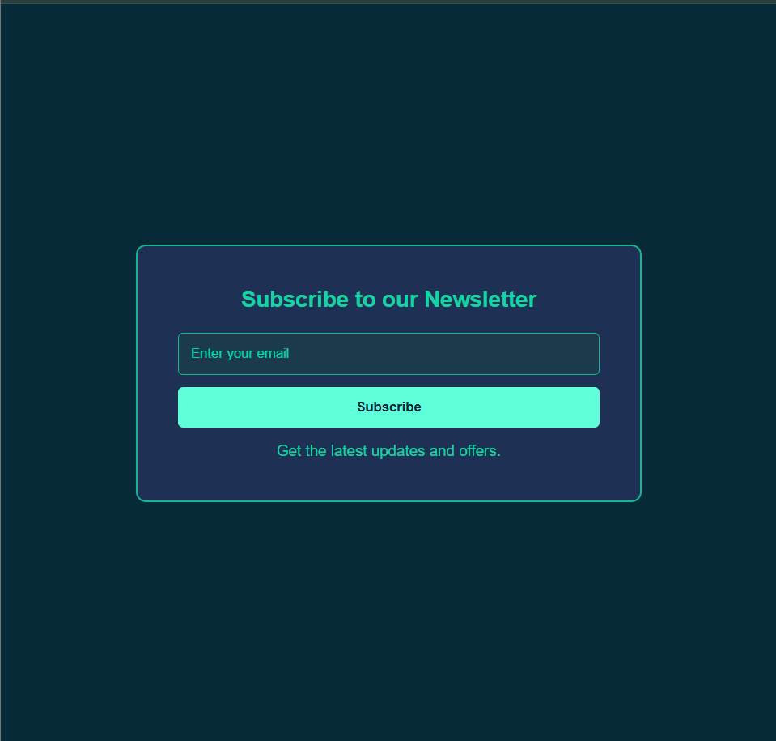

# Newsletter Subscription

A responsive newsletter subscription page built using HTML and CSS.

## ✨ Features

- Responsive design
- Email input field
- Placeholder text
- HTML5 required validation
- Hover effects
- Modern UI

## 🛠 Technologies Used

- HTML5
- CSS3

## 📚 What I Learned

During this project, I learned:

- How to create semantic HTML forms.
- How to style forms using Flexbox.
- How to use the `placeholder` attribute.
- How the `required` attribute provides built-in HTML validation.
- How to create hover effects using the `:hover` pseudo-class.
- How browser caching can affect GitHub Pages and how to resolve it using a hard refresh or by disabling cache during testing.
- How to use Git and GitHub to commit, push, and deploy project updates.

## 🚀 Live Demo

https://shadowmask86.github.io/Newsletter-Subscription/

## 📸 Screenshot

## 💻 How to Run Locally

1. Clone the repository.
2. Open `index.html` in your browser.

## 👨‍💻 Author

**Shreyash**